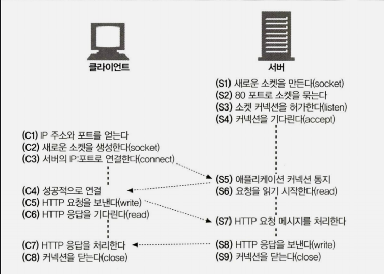

# be-was-2024

## 구현 과정

- InputStream을 이용해서 HTTP message를 받는 기능 구현
- HTTP message를 받아서 requestLine에서 URL만 추출하는 기능 구현

## 고민한점

- RequestLine이 디렉토리인 경우 index.html를 읽어와야 하고 아닌경우 파일을 읽어야 하는데 이를 어떻게 구현할지 고민했다. RequestLine에서 파일이나
  디렉토리의 경로를 파싱할 수 있기 때문에 이를 File 객체로 만든 뒤 `isDirectory()`를 사용해서 간단하게 해결했다.
- 학습 요구사항을 보면 NIO를 사용하지 말라고해서 FileInputStream의 readAllBytes()를 사용했는데 이것이 의도한 방향인지 잘 모르겠다. 다른 방법으로
  파일을 byte단위로 읽을 수 있는지 더 고민해 봐야겠다.
- Thread를 Concurrent 패키지를 이용해서 재구현하라고 했는데 단순히 ExecutorService를 이용해서 구현했다. 지금은 20개의 thread를 최대치로
  스레드풀을 구성하기만 했는데 동시성 문제를 해결하기 위해서 더 사용할 기능이 있는지 확인해봐야 한다고 느낀다.

## 학습내용

### 1. HTTP Request를 InputStreamReader만으로 받지 않고 BufferedReader가 필요한 이유

- InputStreamReader는 InputStream을 통해서 Byte단위로 읽던 데이터를 char로 디코딩한다. 그러면 네트어크 I/O stream은 char단위로 흐르게
  되는데 HDD 네트워크의 I/O속도는 매우 느리다(메모리와 비교해서).
- Performane를 향상시키기 위해 Buffer를 이용하기로 했다. Buffer를 이용하면 Buffer 메모리에 Char를 특정 Size만큼 저장한 후 한 번에 전송한다. (
  Default = 8192char = 8KB).

### 2. Java의 Socket Programming

- 클라이언트와 서버가 TCP 소켓 인터페이스를 사용하여 상호작용하는 것은 다음과 같다.
  자바 또한 Socket Programming에 관한 API가 구현되어 있고 해당 기능들이 존재한다. 그러나 다른 언어(ex.C)와 달리
  자바에서는 `socket.accept()`만 호출하면 S1부터 S3의 과정을 자동으로 실행한다.
  

### 3. Java 버전별 Thread  기능 변화

